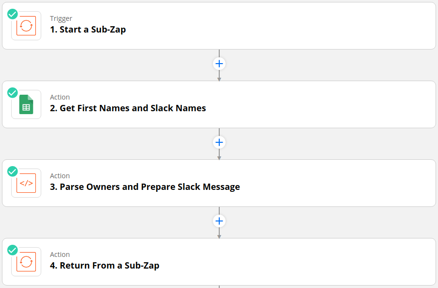
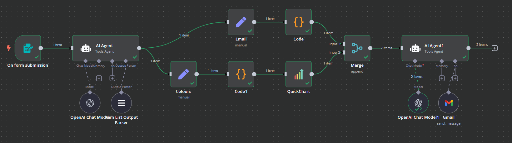
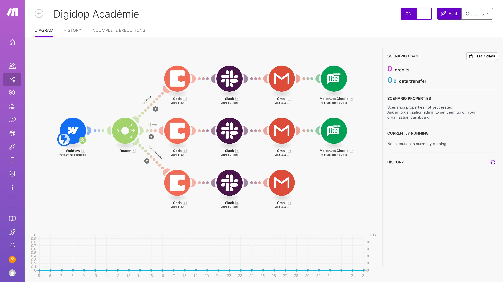

# Formbricks Workflows - Proposal

## 1. Overview

For the initial release, I would prioritize a **simple and predictable user experience**, based on a linear model (`trigger → condition → action`). This approach aligns with how users typically adopt workflow tools and enables fast onboarding without unnecessary complexity.

At the same time, the most critical aspect to get right early is the **underlying data model and extensibility layer**, particularly the workflow schema and the integration/action registry.

These form the foundation for future capabilities such as branching, long-running workflows, human-in-the-loop steps, and AI-assisted creation.

The proposed approach is therefore:

- **Keep the editing experience simple and focused from the start**
- **Invest in a flexible, well-structured foundation that supports future growth**

This lets us iterate quickly on the UI while avoiding costly changes to the core system later.

## 2. Learnings from similar tools

Our first release will likely be compared to competitors, so it's important to understand what they got right and wrong.

### Zapier (Zaps)

Linear by default. Users build 80% of automations without needing a graph. Fast to author, easy to scan, and hard to break.

### n8n

Powerful graph canvas, but the learning curve is high. New users rarely start from an empty canvas.

### Make (Integromat)

Visually impressive, but the canvas carries significant product cost — zoom, pan, connectors, auto-layout, keyboard access — none of which is free.

### Takeaway
I'd argue these tools succeeded because of their rich action catalogs (available integrations and actions), not because of their UIs.

So for our Workflows feature, at least in the first iterations, I'd skip the complexity of a graph canvas and invest more in the catalog and a step-based builder.

## 3. Principles

The principles of this proposal focus on:

- Stable model in an evolving UI. The JSON shape of a workflow is a long-term API; the editor is disposable and interchangeable.
- Prevent invalid configurations by design. Types and schemas carry the validation.
- Progressive complexity. Invest in linear workflows now, branching later. Canvas only if we see a real need.
- Extensible by configuration. Adding a new destination should be as simple as configuring a few files, not rewriting a feature.

## 4. Foundation

Part of the implementation should also focus on getting the Workflows schema right (status, steps, actions, etc.).

- A workflow and its steps should be serializable and machine-readable, so they can also be easily generated by AI.
- We should also have a reusable registry of action definitions, instead of hardcoding them.

### 5. Editing experience

- A basic app shell (header, side nav, etc.)
- Workflows list page
- Creation/Editor page
  - Shows the linear workflow as step cards
  - Editing a step opens a drawer on the side with a form
- Drag and drop is out of scope for v1

### 6. Front-end Stack

- React 19 + TypeScript
- React Router in SSR mode — lightweight and gives full control over routing and the server layer
- Zod for validation
- shadcn/ui + @base-ui/react for UI primitives
- Tailwind CSS for styling
- Zustand or Jotai for complex state management
- TanStack Query for server/API communication
- Vitest + Playwright for testing

### 7. State and data

We have 3 layers:

- Server state (TanStack Query)
- Global workflow editor draft changes (in a state library like Jotai)
- Individual workflow step state

### 8. Trade-offs

- Linear list over graph canvas: faster to ship, fewer invalid states, accessible — but less impressive.
- Zod everywhere instead of handwritten validations: one source of truth, shareable with the backend and LLMs. Cost: not portable to other languages.
- Zustand/Jotai over Redux/XState: the editor is not a state machine (yet), so we don't need the complexity Redux/XState brings.
- Extensible by default over highly opinionated UIs: the data model is the cheapest thing to get right today, and the most expensive thing to change once customers depend on it.
- Registries over hardcoded forms: slightly more work for the initial integrations, but much less work to add new ones.
